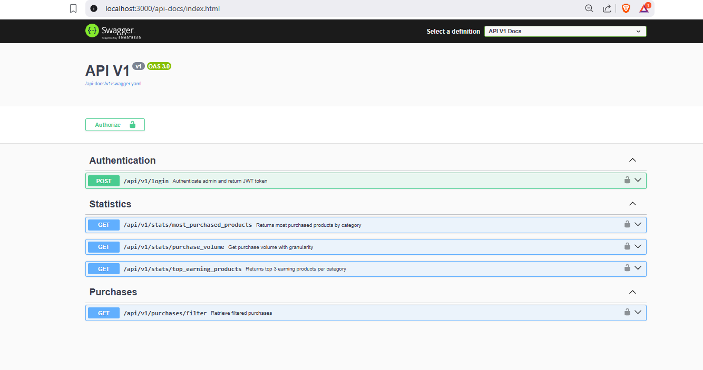

# Reto Técnico - API Ecommerce

Este repositorio contiene una aplicación API desarrollada con Ruby on Rails para la gestión de compras de un ecommerce. Incluye autenticación por JWT, documentación con Swagger, análisis de compras, envío de correos, manejo de imágenes de productos, y más.

## Vista general

La documentación de los servicios está disponible en Swagger en la siguiente URL:

[http://localhost:3000/api-docs/index.html](http://localhost:3000/api-docs/index.html)

A continuación, se muestra una captura de los endpoints generados:



---

## Requisitos para ejecutar el proyecto

Para levantar el servidor desde cero se utiliza **Docker**. No es necesario tener Ruby, Rails ni PostgreSQL instalados localmente.

### Dependencias

* Docker
* Docker Compose

---

## Versiones utilizadas

| Tecnología | Versión                |
| ---------- | ---------------------- |
| Ruby       | 3.2.3                  |
| Rails      | 7.0.8                  |
| PostgreSQL | 14                     |
| Redis      | 7                      |

---

## Diagrama de base de datos

A continuación se muestra una representación general del modelo de base de datos utilizado en la aplicación:

**(Aquí insertar el diagrama de entidades-relaciones: productos, categorías, compras, clientes, usuarios admins, etc.)**

---

## Instrucciones de instalación y ejecución

1. Clona el repositorio:

   ```bash
   git clone https://github.com/edr122/rails-ecommerce.git
   cd rails-ecommerce
   ```

2. Construye y levanta los contenedores:

   ```bash
   docker-compose build --no-cache
   docker-compose up
   ```

3. Crea y prepara la base de datos:

   ```bash
   docker-compose run --rm web rails db:create db:migrate db:seed
   ```

4. Para ejecutar pruebas en entorno de test:

   ```bash
   docker-compose run --rm -e RAILS_ENV=test web rails db:create db:migrate db:seed
   docker-compose run --rm -e RAILS_ENV=test web bundle exec rspec
   ```

---

## Mailtrap para pruebas de correo

El envío de correos (por ejemplo, para notificación de primera compra o reportes diarios) se verifica usando [Mailtrap](https://mailtrap.io). Se ha configurado como servidor SMTP por defecto en el entorno de desarrollo.

**(Aquí insertar una captura del inbox de Mailtrap con el correo recibido)**

---

## Consideraciones adicionales

* **Paginación en servicio de compras**: el endpoint `/api/v1/purchases/filter` acepta los parámetros `page` y `per_page` para paginar los resultados.

* **Validaciones en servicio de volumen de compras**: el endpoint `/api/v1/stats/purchase_volume` requiere obligatoriamente:

  * `from_date` y `to_date` en formato `YYYY-MM-DD`.
  * `granularity` (`hour`, `day`, `week`, `year`).
  * El rango máximo entre fechas es de 6 meses.

* **Autenticación JWT**: todos los servicios están protegidos mediante tokens JWT. Se obtiene mediante el login `/api/v1/login` con email y contraseña de un `AdminUser`.

---

## Postman

Se ha incluido un archivo de colección Postman con todos los endpoints disponibles y ejemplos de uso.

**(Adjuntar aquí o referenciar el archivo `postman_collection.json`)**

---

## Otras funcionalidades implementadas

* **Manejo de imágenes de productos**: se utilizó `ActiveStorage`, permitiendo asociar 0 o más imágenes a cada producto.

* **Historial de cambios**: se implementó seguimiento de cambios con la gema `paper_trail` en modelos como `Product`, permitiendo consultar versiones anteriores.

* **Tareas programadas con Sidekiq Scheduler**: se ejecuta un job diario (`DailyPurchaseReportJob`) que envía un resumen de compras a los administradores.

---

## Notas finales

Este proyecto está preparado para correr en entornos de desarrollo utilizando contenedores Docker, facilitando así su despliegue o pruebas sin configuraciones adicionales.
